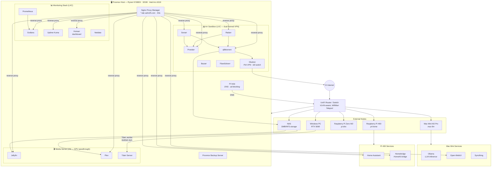
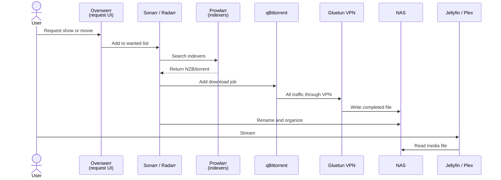
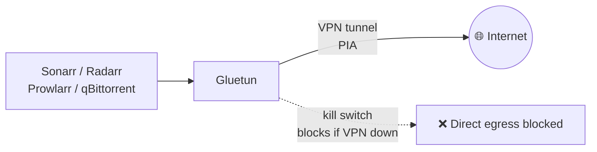
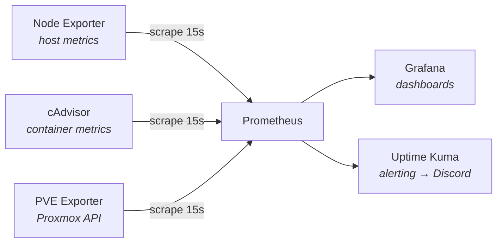

# Homelab Overview

## Full Architecture Diagram

---

## Service Breakdown

### Proxmox Host

The single Proxmox node is the core of the lab. All LXC containers and VMs run here. The Intel Arc A310 GPU is passed through to the Media Server VM for hardware-accelerated transcoding.

| Container / VM | Type | Services |
|----------------|------|----------|
| Pi-hole | LXC | DNS resolver, network-wide ad blocking |
| Nginx Proxy Manager | LXC | Reverse proxy, SSL termination for all services |
| Monitoring Stack | LXC | Prometheus, Grafana, Uptime Kuma, Homarr, Netdata, cAdvisor, PVE Exporter |
| Arr Sandbox | LXC (dual-homed) | Gluetun VPN, Sonarr, Radarr, Prowlarr, qBittorrent, Bazarr, FlareSolverr |
| Proxmox Backup Server | LXC | Scheduled VM/LXC snapshots to NAS |
| Media Server | VM | Jellyfin, Plex, Tdarr server — GPU passthrough |

### External Nodes

| Node | Hardware | Services |
|------|----------|----------|
| Mac Mini (mac-llm) | Apple M2 Pro | Ollama (LLM inference), Open-WebUI, Syncthing |
| Pi 400 (pi-home) | Raspberry Pi 400 | Home Assistant, Homebridge (HomeKit) |
| Pi Zero W2 (pi-dns) | Raspberry Pi Zero W2 | Pi-hole (DNS) |
| Windows PC (storm) | RTX 5090 | Tdarr remote worker (NVENC AV1 transcoding) |
| NAS (UNAS) | — | SMB/NFS media storage (movies, TV, music) |

---

## Media Pipeline

How a media request goes from click to stream:

---

## VPN Isolation

The Arr Sandbox LXC is dual-homed. Download traffic can only exit through the VPN VLAN — it never touches the home IP. The kill switch blocks all internet traffic if the VPN tunnel drops.

---

## Monitoring Stack

---

## Technology Stack Summary

| Layer | Technology |
|-------|-----------|
| Hypervisor | Proxmox VE 9.1.1 |
| Containers | LXC + Docker Compose |
| VMs | KVM |
| Reverse proxy | Nginx Proxy Manager |
| DNS / ad block | Pi-hole |
| VPN | Gluetun + PIA (OpenVPN) |
| Media servers | Jellyfin (primary), Plex |
| Media automation | Sonarr, Radarr, Prowlarr, Bazarr, qBittorrent |
| Transcoding | Tdarr (Intel QSV + NVENC AV1) |
| Metrics | Prometheus + Grafana + Node Exporter |
| Alerting | Uptime Kuma → Discord |
| LLM inference | Ollama (Apple M2 Pro) |
| LLM frontend | Open-WebUI |
| Home automation | Home Assistant + Homebridge |
| Remote access | UniFi WifiMan Teleport |
| File sync | Syncthing |
| Backups | Proxmox Backup Server |
