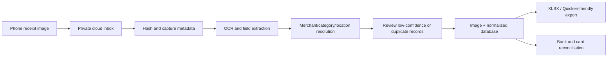

# Personal Automation Roadmap

This page captures planned personal workflow systems that may integrate with Hermes and the homelab. They are **not deployed services** yet.

## Job Hunter + Hermes

The job-hunter expansion is intended to make Hermes a review-driven assistant for the full application lifecycle:

```mermaid
flowchart LR
    Sources["Approved job sources"] --> Ingest["Ingest and deduplicate"]
    Ingest --> Match["Match to candidate profile"]
    Match --> Draft["Draft tailored materials"]
    Draft --> Review["Human review and approval"]
    Review --> Assist["Browser/API-assisted form filling"]
    Assist --> Submit["Explicit submission confirmation"]
    Submit --> Track["Application and follow-up tracker"]
```

### Planned capabilities

- Collect job URLs and descriptions from approved sources.
- Normalize employer, title, location, compensation, work mode, requirements, source, and closing date.
- Score opportunities against a private candidate profile and explain the score.
- Draft tailored resumes, cover letters, recruiter messages, and screening answers from approved source material.
- Track applications, contacts, deadlines, follow-ups, and outcomes.
- Use Hermes with browser automation or supported APIs to populate repetitive forms after approval.

### Safety and privacy boundaries

- Human approval is required before any application is submitted.
- Hermes must not fabricate experience, qualifications, work authorization, sponsorship status, or screening answers.
- CAPTCHA, unexpected identity questions, or blocked automation must stop the workflow for manual intervention.
- Personal documents, identifiers, recruiter correspondence, and application history belong in a private access-controlled store, not Git.
- Every generated draft and submission should retain source, approval, edit, and timestamp metadata.

## Receipt Ingest

Receipt Ingest will accept receipt images uploaded from a phone to a private cloud inbox, preserve the originals, extract structured data, and produce an Excel-compatible ledger for Quicken and budget management.

### Data to retain

Each receipt should have a stable ID and link to its original image, plus the image hash, merchant, transaction date, total, tax, currency, payment method, line items, category, location, OCR confidence, provenance, review status, and export/reconciliation status.

Location should come from receipt address or geotag where possible. Geocoded values must retain their source and confidence; they are not authoritative until reviewed.

### Requirements

- Private authenticated upload and encrypted storage/backups.
- Idempotent ingestion and hash-based duplicate detection.
- Original images are immutable and are never deleted merely because an export was created.
- Low-confidence OCR, unreadable images, conflicting totals, and duplicates go to a review queue.
- Financial data and receipt images stay out of this public repository.
- Validate the target Quicken import workflow with a sample before calling the export compatible.

## Delivery phases

1. Foundation: choose the private inbox, storage, database, and backup policy.
2. Receipt MVP: image ingest, OCR of core fields, review queue, and XLSX export.
3. Reconciliation: bank/card matching and category rules.
4. Job Hunter MVP: private profile, job normalization, drafting, review, and tracking.
5. Assisted applications: browser/API assistance with explicit approval and audit records.

## Open decisions

- Private cloud destination for phone uploads.
- Database-first, spreadsheet-first, or dual-ledger design.
- OCR and geocoding providers with acceptable privacy and cost.
- Target Quicken edition and import format.
- Network placement and isolation for personal documents and automation workers.
